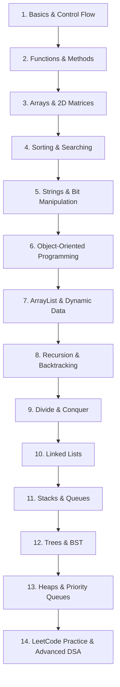

# Java Fundamentals & Data Structures Mastery

Welcome to **Java Fundamentals & Data Structures Mastery** — a clean, structured, and beginner-friendly learning repository designed to take you from core Java syntax to advanced Data Structures and Algorithms (DSA).

---

## 🎯 Repository Purpose

This repository serves as a hands-on, practical code hub for learning Java programming. Every program is self-contained with educational header documentation, step-by-step logic, and comments explaining **why** specific approaches are chosen, common beginner mistakes, and algorithm nuances.

---

## 💡 What You Will Learn

- Core Java syntax, operators, control flow, loops, and functions.
- Bitwise manipulation techniques and binary arithmetic.
- Object-Oriented Programming (OOP) principles (Encapsulation, Inheritance, Polymorphism, Abstraction).
- Fundamental data structures: Arrays, 2D Matrices, ArrayLists, Strings, Linked Lists, Stacks, Queues, Binary Trees, Binary Search Trees, and Heaps.
- Classical algorithms: Searching (Linear, Binary), Sorting (Bubble, Selection, Insertion, Counting, Merge Sort), Recursion, Backtracking, and Greedy Algorithms.
- Problem-solving skills using popular LeetCode questions.

---

## 🛠️ Technologies Used & Requirements

- **Language**: Java
- **Target Java Version**: Java 17+ (Compatible with Java 21 / 26)
- **Compiler**: OpenJDK `javac` / JDK
- **Build Tool**: Native Java CLI (No external build tools required)

---

## 📁 Repository Folder Structure

```text
Java-Fundamentals-DSA/
├── Basics/                 # Core Java fundamentals (variables, loops, conditions, functions)
├── BitManipulation/        # Bitwise operations (get/set/clear bit, even/odd, powers of 2)
├── Strings/                # String manipulation, StringBuilder, comparison, palindrome
├── Arrays/                 # 1D Arrays, Searching, Subarrays, Trapping Rainwater, Stocks
│   ├── 2D_Arrays/          # 2D Matrices, Spiral Matrix, Diagonal Sum, Matrix Search
│   └── Sorting/            # Bubble, Selection, Counting, and Inbuilt Sorting
├── ArrayList/              # Dynamic Arrays, Multi-dimensional ArrayList, Pair Sum
├── OOPS/                   # Classes, Constructors, Inheritance, Polymorphism, Encapsulation
├── RecursionBasics/        # Recursion fundamentals, Factorial, Fibonacci, Binary Strings
├── DivideAndRule/          # Divide & Conquer algorithms (Merge Sort)
├── Backtracking/           # Backtracking on arrays, Subset generation
├── LinkedList/             # Singly Linked List, Add/Remove, Cycle Detection
├── Stacks/                 # Stacks via ArrayList, LinkedList, JCF; Histogram, Parentheses
├── Queue/                  # Queues, Deque, Queue using Stacks, Interleaving, Reversal
├── Greedy/                 # Greedy Algorithms (Activity Selection)
├── BinaryTree/             # Tree Creation, Height, Diameter, Traversal
├── BinarySearchTree/       # BST Insertion, Search, Largest BST in Binary Tree
├── Heaps/                  # Priority Queue, Custom Object Priority Queue, Heap Insertion
├── Leetcode/               # Curated LeetCode problem solutions with detailed explanations
├── Practice/               # Additional practice problems organized by topic
├── CONTRIBUTING.md         # Contribution guidelines
├── LICENSE                 # MIT License
└── README.md               # Main repository documentation
```

---

## 📚 Topics Covered

| Topic | Key Concepts Covered |
| :--- | :--- |
| **Basics** | Conditional statements, loops (`for`, `while`), functions, method overloading, prime check |
| **Bit Manipulation** | Binary operators (`AND`, `OR`, `XOR`, `NOT`), bit masking, checking odd/even |
| **Strings** | String immutability, `char` manipulation, `StringBuilder`, palindrome, sub-strings |
| **Arrays & 2D Arrays** | Subarrays, Kadane's Algorithm, Trapping Rainwater, Buy/Sell Stocks, Matrix Search |
| **Sorting** | Bubble Sort, Selection Sort, Counting Sort, Java Inbuilt `Arrays.sort()` |
| **ArrayList** | Dynamic sizing, 2D ArrayLists, Two-pointer technique (Container With Most Water, Pair Sum) |
| **Object-Oriented Programming** | Classes, Objects, Access Modifiers, Constructors (Shallow/Deep Copy), Inheritance |
| **Recursion & Backtracking** | Base cases, call stack, array backtracking, subset generation |
| **Divide & Conquer** | Merge Sort algorithm breakdown |
| **Linear Data Structures** | Linked Lists, Stacks, Queues, Deque, Stack/Queue conversions |
| **Trees & Heaps** | Binary Trees, Binary Search Trees (BST), Priority Queue, Min/Max Heaps |
| **LeetCode Problem Set** | Selected standard LeetCode problems (Array, Linked List, Stack, String) |

---

## ⚡ How to Compile and Run Programs

Navigate to the repository directory in your terminal and compile any Java program using `javac`, then run it with `java`:

```bash
# Example 1: Running a program from Basics
javac Basics/calculator.java
java Basics.calculator

# Example 2: Running a program from Arrays/Sorting
javac Arrays/Sorting/bubbleSort.java
java Arrays.Sorting.bubbleSort

# Example 3: Running a LeetCode solution
javac Leetcode/solution01.java
java Leetcode.solution01
```

*Note: Clean up generated `.class` files using `find . -name "*.class" -delete` (Linux/Mac) or `del /s *.class` (Windows).*

---

## 🗺️ Learning Roadmap (Beginner → Advanced)



---

## 📋 Future Topics Checklist

- [ ] **Hashing** (HashSet, HashMap, Custom Hash Functions, Collision Resolution)
- [ ] **Tries** (Prefix Trees, Insert, Search, StartsWith)
- [ ] **Graph Data Structure** (Adjacency List/Matrix, BFS, DFS, Topological Sort)
- [ ] **Shortest Path Algorithms** (Dijkstra's Algorithm, Bellman-Ford, Floyd-Warshall)
- [ ] **Minimum Spanning Tree (MST)** (Prim's Algorithm, Kruskal's Algorithm, Disjoint Set Union)
- [ ] **Dynamic Programming (DP)** (1D DP, 2D DP, Knapsack, Longest Common Subsequence)
- [ ] **Segment Trees & Fenwick Trees** (Range Queries & Updates)

---

## 📄 License

This repository is licensed under the [MIT License](LICENSE).
